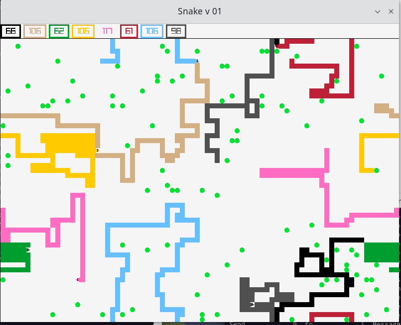

# Fortran Snake

This is just a short attempt to code a classical "Snake" game
in Fortran.



## Installation

### 1 Raylib

Download, build and install raylib library using instructions from here:
- https://github.com/raysan5/raylib/wiki/Working-on-GNU-Linux

Installing dependecies:
```sh
$ sudo dnf install alsa-lib-devel mesa-libGL-devel libX11-devel libXrandr-devel libXi-devel libXcursor-devel libXinerama-devel libatomic
```

Buliding raylib:
```sh
$ git clone --depth 1 https://github.com/raysan5/raylib.git raylib
$ cd raylib/src/
$ make PLATFORM=PLATFORM_DESKTOP # To make the static version.
$ sudo make install # Static version
```

Testing the installation
```
$ cd raylib/examples
$ make PLATFORM=PLATFORM_DESKTOP
```

### 2 Download and compile Fortran bindings with raylib

- https://github.com/interkosmos/fortran-raylib
```sh
$ git clone --depth 1 https://github.com/interkosmos/fortran-raylib
$ cd fortran-raylib
$ make
```

### 3 Tune the build script to your needs

In `build.sh` set the path to the directory containing `fortran-raylib`
code.

### 4 Compile and run the game

```sh
$ ./build.sh
$ ./a.out
```

## Instructions

The game speed, board size, number of snakes and number of food is
controlled by modifying the source code.

- Press 'R' anytime to restart the game
- Press 'X' anytime to make "Snake #1" grow

All snakes are controlled by a computer. To control "Snake #1" manually,
uncomment a line in `initialize` subroutine. The snake is then controlled
by 'ASDW' keys.

